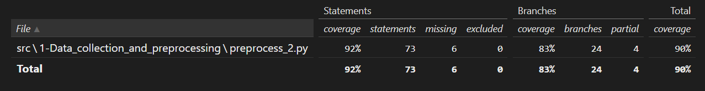
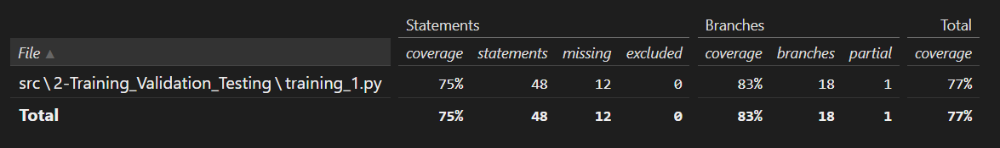
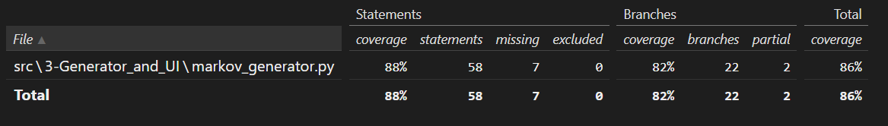

# Testing

## Preprocessing test

**Test: Major key normalization**

Verifies that the key normalization routine correctly handles music in a major mode by transposing it to a common reference key. A minimal symbolic music stream containing a single pitch and an explicitly defined major key context is passed to the normalization function. The test asserts that the function completes successfully and returns a valid musical stream object. To reproduce this test, one must construct a simple music stream with a declared major key and invoke the normalization routine within a unit testing framework.

**Test: Minor key normalization**

Evaluates the behavior of the key normalization logic when applied to music in a minor mode. The input consists of a simple stream with one pitch and an explicitly defined minor key signature. The function is expected to transpose the music to the standard minor reference key and return a valid stream object. Reproduction requires creating a basic minor-key stream using a symbolic music library and executing the normalization function under test conditions.

**Test: Fallback behavior on key analysis failure**

Checks the robustness of the normalization function when key detection fails. A deliberately malformed object that raises an exception during key analysis is used as input. The expected behavior is that the function returns the original object unchanged, demonstrating graceful error handling. This test can be reproduced by mocking or defining an object whose key analysis method throws an exception and passing it to the normalization routine.

**Test: MIDI parsing with invalid file path**

Confirms that the MIDI parsing function correctly reports failure when given a non-existent or unreadable file path. The input is an invalid file reference, and the expected outcome is the absence of extracted tokens accompanied by an error indication. To reproduce the test, call the parsing function with a clearly invalid file path and verify that it does not raise an uncaught exception.

**Test: MIDI parsing of a simple note**

Validates that a valid MIDI file containing a single musical note is correctly parsed into a token sequence. A temporary MIDI file is generated programmatically with a fixed key context to avoid transposition side effects. The test checks that the output is a list of tokens and that it contains the expected representation of the note. Reproduction involves creating a temporary MIDI file with one note, parsing it, and inspecting the resulting token list.

**Test: MIDI parsing with chords**

Examines how the parser handles harmonic structures by ensuring that, when a chord is encountered, only the highest pitch is extracted and tokenized. The input is a temporary MIDI file containing a single chord with multiple pitches. The expected result is a token sequence that includes the pitch corresponding to the highest note in the chord. To reproduce this test, generate a MIDI file with a multi-note chord and parse it using the MIDI processing function.

**Test: Skipping processing when output already exists**

Ensures that the entry-processing function does not overwrite existing outputs. The setup includes a temporary output directory containing a pre-existing JSON file corresponding to the MIDI entry. The function is expected to detect the file and return a message indicating that processing was skipped. Reproduction requires creating a dummy output file in the target directory before invoking the processing function.

**Test: Error handling when MIDI parsing fails in entry processing**

Verifies that the entry-processing function propagates parsing failures as an error message rather than crashing. The input metadata references an invalid MIDI file, leading to a parsing error. The expected behavior is a returned message signaling an error condition. To reproduce this test, provide metadata pointing to a non-valid MIDI file and call the processing routine.

**Test: Successful JSON output creation**

Confirms that a valid MIDI file and corresponding metadata result in the creation of a structured JSON output. A temporary directory is used both for the MIDI source and the output location, and the data root is overridden to ensure correct path resolution. The test asserts that the expected JSON file is created after processing. Reproduction involves generating a simple valid MIDI file, supplying appropriate metadata, and running the entry-processing function.

**Test: Parallel dataset processing reads CSV without crashing**

Assesses whether the parallel processing function can read a dataset description file and iterate through its entries without raising unexpected exceptions. A minimal CSV file with one entry and a deliberately invalid MIDI file is used to exercise the control flow. The test focuses on stability rather than correctness of output, asserting that the function completes execution. To reproduce this test, create a small CSV file with the required columns and invoke the parallel processing function with a limited number of worker processes.

## Training

**Test: Missing training folder handling**

Verifies that the sequence-loading function correctly enforces the existence of the training data directory. The function is invoked with a path that does not exist on the filesystem, and the expected behavior is the immediate raising of a file-related exception. No input files are involved beyond the invalid path itself. The test can be reproduced by calling the loading function with a clearly non-existent directory and observing that it fails deterministically with the appropriate exception.

**Test: Loading only valid JSON files containing tokens**

Evaluates the file-filtering and content-validation logic of the sequence loader. The input consists of a temporary directory populated with multiple files: a valid structured data file containing a token sequence, a structured file missing the required token field, and a non-structured file with an unrelated extension. The function is expected to return only the token sequence from the valid file while ignoring the others. Reproduction requires creating a directory with mixed file types and invoking the loader on that directory.

**Test: Training with empty input sequences**

Confirms that the Markov chain training routine behaves correctly when no training data is provided. An empty list of sequences is passed as input, and the expected output is an empty probabilistic model. The test uses no file-based inputs and can be reproduced by directly calling the training function with an empty list.

**Test: Skipping sequences shorter than the model order**

Checks that the training algorithm ignores sequences that are too short to produce valid state transitions. The input consists of multiple sequences whose lengths are less than or equal to the specified Markov order. The expected result is an empty model, indicating that no transitions were learned. Reproduction involves passing short sequences to the training function while specifying an order that exceeds their usable length.

**Test: Probability normalization in a simple chain**

Validates the correctness of probability computation in the trained model. A single deterministic sequence is used as input, and the model is trained with a first-order configuration. The test asserts that the transition probabilities associated with a given state sum to one, demonstrating proper normalization of counts into probabilities. This test can be reproduced by training on a minimal deterministic sequence and inspecting the resulting probability distribution.

**Test: Handling repeated transitions**

Examines whether the training routine correctly aggregates repeated transitions into a single probability distribution. The input sequence contains multiple occurrences of the same state-to-token transition. The expected behavior is that the resulting probability for that transition is one, reflecting its exclusive occurrence. Reproduction involves training a first-order model on a sequence with repeated patterns and checking the learned transition probabilities.

**Test: Rejecting non-string state elements when saving a model**

Ensures that the model serialization function enforces JSON compatibility constraints on state representations. The input model contains state definitions that cannot be safely converted into string-based keys. The expected behavior is that a type-related exception is raised rather than silently producing invalid output. To reproduce this test, attempt to save a model whose state identifiers are not representable as strings.

**Test: Error propagation when saving to nested directories**

Verifies that directory creation does not mask serialization errors. The input model again contains invalid state representations, but the output path is nested within multiple non-existent directories. The function is expected to create the required directories and still raise a type-related exception due to invalid state content. Reproduction involves attempting to save such a model to a deeply nested path and confirming that the error is propagated.

## Markov generator

**Test: Transposing the end-of-sequence token**

Verifies that the note transposition utility correctly handles the special termination token. The input consists solely of the end marker together with an arbitrary semitone offset. The expected behavior is that the function returns the termination token unchanged, ensuring that structural markers are preserved during transposition. This test can be reproduced by calling the single-note transposition function with the end token and any integer semitone value.

**Test: Positive semitone transposition of a note**

Checks that the note transposition logic correctly increases a pitch by a positive number of semitones. The input is a single note encoded as a numeric pitch token and a positive offset. The output is expected to reflect the correct numerical increase in pitch. Reproduction involves invoking the transposition function with a valid note token and a positive semitone value and verifying the resulting pitch.

**Test: Negative semitone transposition of a note**

Mirrors the previous one but focuses on downward transposition. A valid note token is combined with a negative semitone offset, and the test asserts that the resulting pitch is decreased accordingly. To reproduce this test, call the note transposition function with a negative offset and inspect the returned token.

**Test: Sequence-wide transposition**

Validates that sequence transposition is applied consistently to all elements in a note sequence. The input is a short list of note tokens and a semitone offset. The expected output is a new list in which every note has been transposed by the same amount. Reproduction requires passing a list of note tokens to the sequence transposition function and verifying that each element is transformed as expected.

**Test: Invalid Markov order validation**

Ensures that input validation correctly rejects unsupported Markov orders. The input specifies an order outside the allowed range while keeping all other parameters valid. The expected behavior is a validation error before any generation logic is executed. This test can be reproduced by calling the validation routine or the generation function with an invalid order value.

**Test: Seed length and order mismatch validation**

Checks that the validation logic enforces consistency between the Markov order and the length of the seed sequence. The input deliberately provides a seed whose length does not match the specified order. The function is expected to raise a validation error. Reproduction involves calling the validation function with mismatched order and seed length values.

**Test: Unsupported musical key validation**

Confirms that only predefined musical keys are accepted. The input specifies a key that is not present in the supported key mapping. The expected outcome is a validation error before model loading or generation begins. Reproduction requires calling the validation logic with an unsupported key identifier.

**Test: Acceptance of valid input configuration**

Ensures that the validation logic allows a fully valid configuration to pass without raising an exception. All input parameters conform to the expected constraints. The test can be reproduced by supplying a valid order, a seed of matching length, a positive measure count, and a supported key.

**Test: Returning a cached model instance**

Evaluates the model-loading mechanism’s use of in-memory caching. A preloaded model is manually inserted into the cache, and the loader is invoked for the corresponding order. The expected behavior is that the cached instance is returned without attempting file access. Reproduction involves populating the cache and calling the model-loading function with the same order.

**Test: Missing model file handling**

Verifies that the model loader correctly reports an error when a requested model file does not exist and no cached version is available. The expected behavior is a file-related exception. This test can be reproduced by clearing the cache and attempting to load a model for which no file is present.

**Test: Weighted random choice from a distribution**

Checks that the weighted sampling utility returns a valid key from the provided probability distribution. The input is a simple distribution with multiple possible outcomes. The test asserts that the returned value is one of the defined keys, without enforcing a specific probability outcome. Reproduction requires calling the sampling function with a small distribution and checking membership of the result.

**Test: Propagation of validation errors during generation**

Ensures that the sequence generation routine does not suppress validation errors. An invalid configuration is passed directly to the generation function, and the expected behavior is that the validation error is propagated to the caller. Reproduction involves calling the generation function with invalid parameters.

**Test: Early termination when the initial state is unseen**

Validates that generation stops immediately if the initial state derived from the seed does not exist in the model. The input uses a valid seed and configuration but an empty model. The expected output is the original seed only, with no additional notes generated. Reproduction requires configuring the model cache with an empty model and invoking the generation routine.

**Test: Termination on explicit end token**

Checks that the generation process halts when the next predicted token is the termination marker. The model is configured so that the first transition from the seed leads directly to the end token. The expected behavior is that no additional notes are appended beyond the seed. Reproduction involves loading a model with such a transition and calling the generation function.

**Test: Generation up to the measure-based limit**

Evaluates whether the generation loop respects the maximum number of notes implied by the requested number of measures. A simple deterministic model is provided that produces a sequence of notes before eventually terminating. The test asserts that the output length is consistent with the configured limits. Reproduction requires supplying a model with chained transitions and invoking the generation function with a fixed measure count.

**Test: Transposition to normalized key and back**

Verifies that the generation pipeline correctly normalizes the input seed to a reference key and then transposes the generated sequence back to the original key. The input seed is provided in a non-reference key, and the model immediately terminates generation. The expected result is that the output matches the original seed, demonstrating that forward and reverse transposition are consistent. Reproduction involves configuring a minimal model, selecting a non-reference key, and calling the generation function.

**Test: Generated sequences exist in training data**

Verifies that the generative process does not produce transitions that were never observed in the original training data. The test performs random sequence generation using a randomly selected Markov order between one and four, then examines every contiguous subsequence of length *k+1* in the generated output. Each of these subsequences is checked against the preprocessed original dataset stored in the outputs directory, where all source token sequences are available in a searchable format. The test passes only if every generated *(k+1)*-length sequence can be found at least once in the original data, ensuring that the generator strictly follows learned transition constraints and does not hallucinate unseen state-to-token transitions.

